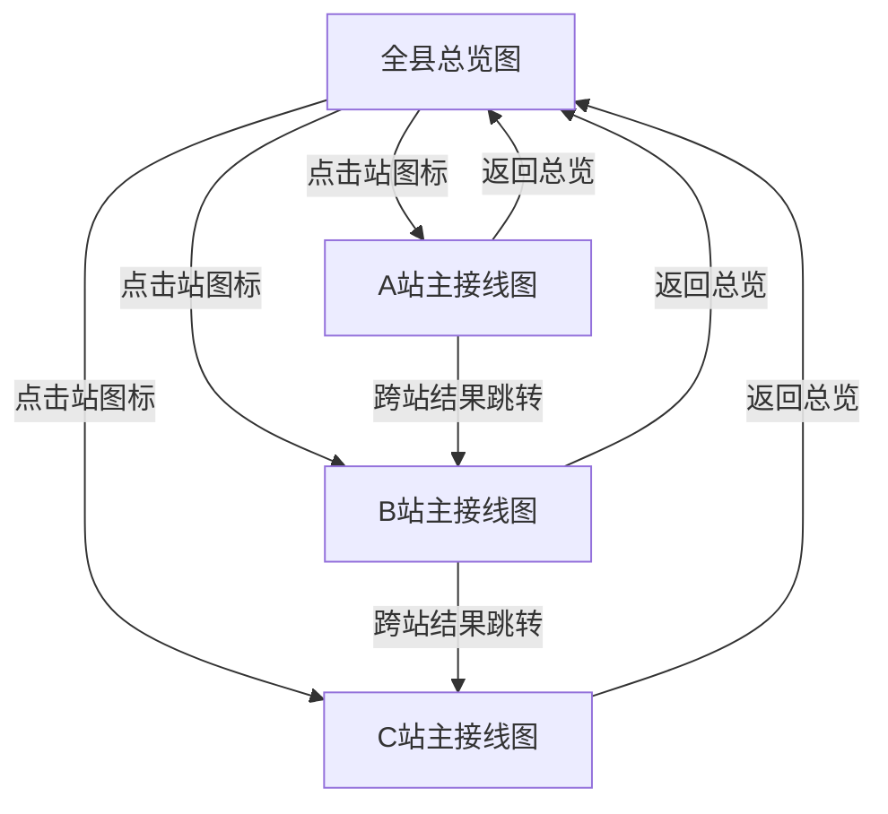

# 最终方案：一站一接线图 + 总览钻取（技术验证）

> 基于多轮确认收敛（置信度 ≥ 95%）  
> 日期：2026-07-10

---

## 一、已确认需求

| # | 结论 |
|---|---|
| 1 | **一站一图**：每座变电站一张主接线图，不是多站画在同一张站内图上 |
| 2 | 站内深度：**主接线级**（母线、进出线、主变、断路器、刀闸） |
| 3 | 导航：**全县总览 → 点站进入站内接线图** |
| 4 | 总览形态：简化站图标 + 站名 + 站间联络线 |
| 5 | 故障分析：**主要在站内接线图**进行 |
| 6 | 接线模板：单母 / 双母 / 桥形等常见主接线都要有 |
| 7 | 跨站影响：站内分析须能标出受影响邻站 / 联络线 |
| 8 | Demo 规模：**3 座站**（总览 + 每站一图 + 不同模板演示） |
| 9 | 模板用法：建站选母线接线型式 + 站内插入出线/主变等间隔模板 |
| 10 | 跨站结果：本站高亮 + 右侧列表；可跳转邻站接线图并继续高亮 |
| — | 视觉：D5000 调度单线图风格（电压色、合红分绿等） |
| — | 连通：考虑开关/刀闸分合；区分电源侧 / 负荷侧 |
| — | 本阶段不做：文档解析、AI 问答、图片识别拓扑 |

---

## 二、信息架构



### 两层画布

1. **总览层（Overview）**
   - 节点：变电站（方框/站徽 + 站名 + 电压等级摘要）
   - 边：联络线（带名称、电压色）
   - 交互：点击站 → 进入该站接线图；不在此层做故障点选（本阶段）

2. **站内层（Station SLD）**
   - 仅渲染当前站的主接线设备与连接
   - 边界出线用「联络端口」关联总览联络线 / 对端站
   - 支持：编辑、分合、设故障、影响分析、模板插入

---

## 三、领域模型

```text
GridProject
  stations: Station[]          // 每站独立 graph
  tieLines: TieLine[]          // 总览联络线：fromStation, toStation, fromPort, toPort
  powerSourceIds / 全局电源标记

Station
  id, name, voltageSummary
  busScheme: single | singleSectionalized | double | bridge | ...
  graph: TopologyGraph         // 仅本站节点/边
  ports: BoundaryPort[]        // 出线边界，挂接 tieLine

BoundaryPort
  id, stationId, deviceId      // 通常对应出线侧刀闸/线路端
  tieLineId?

分析时：将「当前站 graph + 经 tieLine 展开的邻站边界/必要设备」拼成分析用联合图
```

---

## 四、模板体系

### 4.1 建站母线模板（选一生成骨架）

| 模板 | 生成内容 |
|---|---|
| 单母线 | Ⅰ母 + 预留间隔插槽 |
| 单母分段 | Ⅰ母 / Ⅱ母 + 分段断路器+刀闸 |
| 双母线 | Ⅰ母 / Ⅱ母 + 母联间隔骨架 |
| 桥形 | 内桥/外桥简化主变+线路桥接线骨架 |

### 4.2 站内间隔模板（插入拼装）

| 间隔模板 | 典型序列 |
|---|---|
| 出线间隔 | 母线侧刀闸 → 断路器 → 线路侧刀闸 → 边界端口 |
| 主变间隔 | 高压刀闸 → 断路器 → 主变 →（可选）低压侧开关/母线 |
| 电源间隔 | 刀闸 → 断路器 → 电源 |
| 负荷间隔 | 刀闸 → 断路器 → 负荷 |
| 母联/分段 | 按双母或单母分段补齐 |

插入时自动正交对齐到所选母线挂点，名称可改。

---

## 五、影响分析（站内发起 + 跨站）

1. 在站内点选故障设备，按分合状态做电气连通
2. 若连通至边界端口，则经 `tieLines` 扩展到邻站对应端口及邻站导通子图
3. 输出：
   - 本站：受影响岛、电源侧、负荷侧、阻断开关（图上高亮）
   - 跨站：受影响邻站列表、联络线、邻站入口设备
4. 点击邻站 → 打开该站接线图并带入高亮上下文（故障源站/路径提示）

电源侧/负荷侧规则保持不变：导通图 BFS 得岛；电源到故障最短路径为电源侧；其余为负荷侧。

---

## 六、Demo 样例设计（3 站）

| 站 | 母线模板 | 说明 |
|---|---|---|
| A 变电站 | 单母线 | 含电源间隔 + 出线至 B |
| B 变电站 | 双母线 | 进线、母联、主变至 110kV、出线至 C |
| C 变电站 | 桥形（简化） | 进线 + 负荷，演示第三种模板 |

总览：A—B—C 两回联络线（或 A-B、B-C 各一回）。

---

## 七、界面结构

```text
顶栏：返回总览 | 当前站名 | 模式（选择/连线/分合/设故障）| 分析 | 模板 | 导入导出
左侧：图元 + 间隔模板
中部：当前层画布（总览 或 站内）
右侧：属性 / 影响结果（含跨站列表与跳转）
```

视觉：延续 D5000 风格（深色底、电压色、合红分绿、正交走线）。

---

## 八、相对当前代码的改造点

现有 Demo 是「多站设备平铺在同一画布」。将改为：

1. 拆分 `OverviewCanvas` 与 `StationCanvas`
2. `sampleGraph` 拆成 `overview` + `stations.A/B/C` + `tieLines`
3. `ConnectivityAnalyzer` 增加基于 `tieLines` 的跨站扩展
4. 新增 `templates/`（母线骨架 + 间隔插入）
5. 路由状态：`view: 'overview' | 'station', stationId?, highlightContext?`

分析算法单测补充：跨站阻断、跳转上下文不变性。

---

## 九、验收标准（本阶段通过条件）

1. 总览可见 3 站及联络线；点击进入仅显示该站接线
2. 三站分别体现单母 / 双母 / 桥形骨架差异
3. 站内可插入至少一种间隔模板并连到母线
4. 站内故障分析在全合位、分闸阻断下结果正确
5. 故障影响经联络线到达邻站时，右侧列出邻站且可跳转高亮
6. JSON 可保存/恢复「总览 + 各站图 + 联络线」完整工程

---

## 十、明确不做（本阶段）

- 规程文档 / AI 处置问答
- 总览层故障点选
- 完整 D5000 图元库与双母旁路等全部变体
- 20 站全量县网

---

## 十一、建议实施顺序

1. 数据模型与视图切换（总览 ↔ 站内）
2. 重做 3 站样例（一站一图 + 联络端口）
3. 母线/间隔模板
4. 跨站分析 + 跳转高亮
5. 更新 `docs/tech-validation.md` 验收结论
